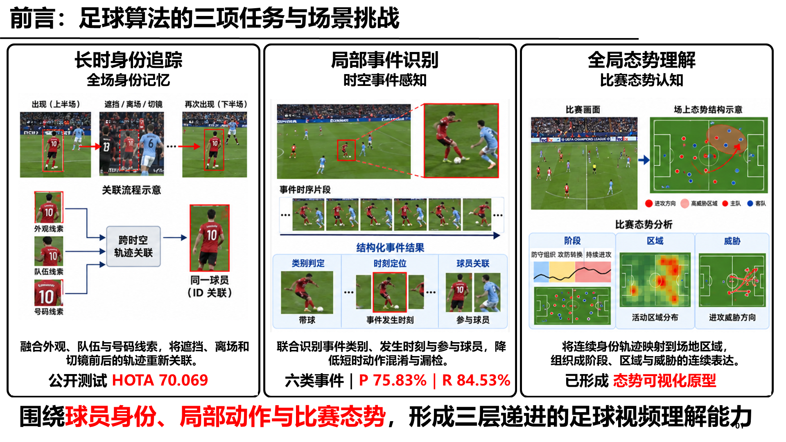
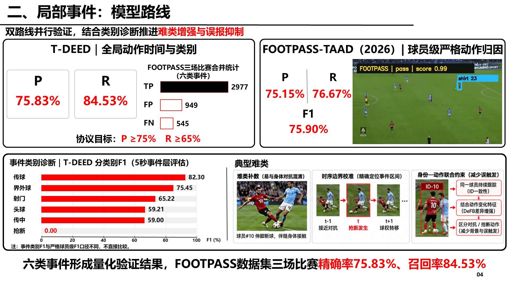
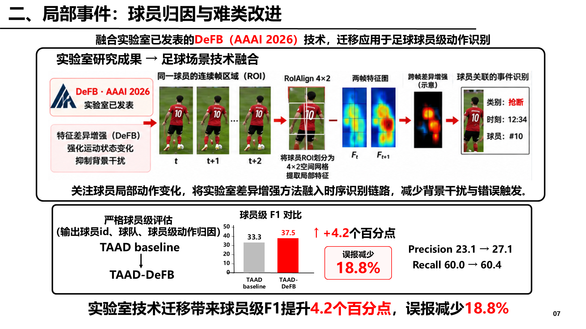

<div align="center">

# 异瞳PPT · Yitong PPT

### 把材料变成讲得清、站得住、还能继续编辑的汇报 PPT

[](https://github.com/tangyouci/yitong-ppt/actions/workflows/validate.yml)
[](LICENSE)
[](SKILL.md)
[](#最终交付)

**学术汇报 · 论文分享 · 项目进展 · 领导汇报 · 答辩 · Tutorial**

</div>

<p align="center">
  
</p>

> 这不是一套换颜色的 PPT 模板。异瞳PPT 是一个面向 Codex 的汇报工作流 Skill：先理解材料和受众，再组织证据、规划页面，最后交付经过检查的可编辑 PPTX。

## 为什么做这个 Skill

常见的 AI PPT 工具擅长“快速铺满十几页”，却容易出现四个问题：叙事像文档摘要、页面只有装饰没有证据、数字与结论失去来源、最终文件难以继续修改。

异瞳PPT 把重点放在汇报真正需要的闭环：

| 普通生成方式 | 异瞳PPT |
| --- | --- |
| 根据一句话直接批量生成页面 | 先识别受众、时长、目标和证据边界 |
| 学术与项目汇报共用一套套路 | 分别采用学术叙事与项目决策叙事 |
| 图很多，但与结论关系弱 | 每页围绕一个问题和一条可见证据链 |
| 复杂页面直接压成整张图片 | 图片版用于探索，主要结构重建为可编辑对象 |
| 容易把计划、目标写成已经完成 | 明确区分实测结果、估算、目标、计划和示意 |
| 文件生成后就结束 | 渲染检查排版、图表、引用、事实和可编辑性 |

## 真实使用案例：足球算法项目汇报

下面三页来自真实项目汇报。这个案例展示了异瞳PPT最核心的页面语言：**真实画面、结构关系、量化证据和一句可验证结论放在同一页内**。

### 示例请求

```text
使用 $yitong-ppt，把足球算法的追踪、局部事件识别和比赛态势理解，
整理成面向管委会的项目进展汇报。

要求：
- 技术不要讲得过细，但必须说明挑战、解决方法和实际进展；
- 能写指标的地方写清指标和评测口径；
- 重点展示局部事件识别、球员归因与难类改进；
- 先确定重点页面的图片版方向，再输出可编辑 PPTX；
- 不得把目标值、计划或示意图写成已经实现的结果。
```

### 1. 总览页：把多个算法任务组织成一条主线

<p align="center">
  
</p>

这类页面用于建立听众的全局认知。Skill 会先提炼任务之间的递进关系，再决定哪些真实画面、指标和结论应当出现在同一页，而不是简单罗列模块名称。

### 2. 诊断页：结果、短板和后续方法在同一页闭环

<p align="center">
  
</p>

这一页不是只展示总体准确率。它把整体结果、分类别诊断、典型难类和改进方向同时呈现，让“为什么还要继续改”有可见证据。

### 3. 方法与结果页：技术迁移必须落到量化收益

<p align="center">
  
</p>

这一页采用“已有技术 → 场景适配 → 球员级评估 → 结果解释”的结构。方法图、评测范围和量化变化互相对应，避免把一张网络结构图当成完整论证。

<details>
<summary><strong>这个案例中，Skill 实际做了哪些判断？</strong></summary>

1. 将领导关心的内容从算法细节改写为挑战、贡献、证据和进度。
2. 将追踪、局部事件和全局态势组织成三个层次，而不是三个孤立章节。
3. 保留数据集、指标口径和评估对象，避免把不同层级的 F1 混为一谈。
4. 用真实比赛画面、局部裁剪、时序条带和紧凑图表替代泛化图标。
5. 将标题、文字、框线、箭头、图表和结论保留为可编辑对象。

</details>

## 工作流


图片版是复杂页面的设计检查点，不是最终交付的替代品。用户要求端到端制作时，Skill 会继续完成可编辑重建，不会在出图后提前停工。

## 两种汇报路线

### 学术汇报

适合论文分享、方向 Tutorial、组会、答辩和会议报告。

默认关注：

- 研究问题是否真实、重要；
- 相关工作如何分类，本文位于哪里；
- 方法流程以及每个模块为什么必要；
- 实验是否支持论文动机和主要主张；
- 局限、审稿人视角和后续研究问题。

典型结构：

```text
问题与价值 → 背景与相关工作 → 动机与缺口 → 方法 → 实验 → 局限 → 思考
```

### 项目汇报

适合立项、阶段进展、领导或客户汇报、工程评审和交付总结。

默认关注：

- 项目要解决什么问题，产生什么价值；
- 本阶段具体完成了什么；
- 有哪些真实输出、指标和验证记录；
- 当前结果距离目标还有多远；
- 风险、依赖、下一步工作和待决策事项。

典型结构：

```text
目标与价值 → 当前挑战 → 技术路线 → 已完成工作 → 证据 → 风险 → 下一步
```

## 一分钟安装

### 最省事的方式

把本仓库网址复制给 Codex 或其他支持 Skill 的 Agent，并告诉它：

```text
请帮我安装 https://github.com/tangyouci/yitong-ppt，
并告诉我如何正确使用这个 Skill。
```

### 使用 Skills CLI

```bash
npx skills add tangyouci/yitong-ppt -g -a codex -y
```

安装完成后重启 Codex，使 Skill 重新加载。

### 手动安装

Windows PowerShell：

```powershell
$SkillsRoot = if ($env:CODEX_HOME) { Join-Path $env:CODEX_HOME 'skills' } else { Join-Path $HOME '.codex/skills' }
git clone https://github.com/tangyouci/yitong-ppt.git (Join-Path $SkillsRoot 'yitong-ppt')
```

macOS / Linux：

```bash
SKILLS_ROOT="${CODEX_HOME:-$HOME/.codex}/skills"
git clone https://github.com/tangyouci/yitong-ppt.git "$SKILLS_ROOT/yitong-ppt"
```

### 更新

```bash
npx skills update yitong-ppt -g -y
```

## 快速使用

在请求中写出 `$yitong-ppt`，并尽量提供材料、受众、汇报时长和交付要求。

<details open>
<summary><strong>论文组会汇报</strong></summary>

```text
使用 $yitong-ppt，把这篇论文制作成 15 分钟中文组会汇报。
先用 2–3 句话总结贡献，再讲清动机、方法流程、关键实验、局限和一个后续想法。
面向了解深度学习但不了解这个方向的同学，最终交付可编辑 PPTX。
```

</details>

<details>
<summary><strong>方向 Tutorial</strong></summary>

```text
使用 $yitong-ppt，制作一份视觉语言模型方向 Tutorial。
不要按论文年份流水账介绍，请按问题变化、方法类别和评测演进组织内容。
听众具备基础深度学习知识，汇报时长 25 分钟。
```

</details>

<details>
<summary><strong>项目阶段汇报</strong></summary>

```text
使用 $yitong-ppt，把这些周报、指标、截图和实验结果整理成 10 页项目阶段汇报。
面向领导，突出问题、已完成工作、量化证据、当前风险和下一步决策。
复杂架构页可以先做图片版方向，再重建为可编辑 PowerPoint。
```

</details>

<details>
<summary><strong>优化已有 PPT</strong></summary>

```text
使用 $yitong-ppt 优化这份工程评审 PPT。
保留现有母版和品牌色，减少大段文字，重新组织章节逻辑，
把系统架构和核心图表改成可编辑对象，并核对所有指标与原始报告。
```

</details>

更多调用方式见 [examples/prompts.md](examples/prompts.md)。

## 最终交付

完整任务默认包含：

- 可编辑的 `.pptx` 文件；
- 最终页面渲染预览；
- 对事实缺口、引用缺口和位图区域的必要说明。

复杂照片、视频帧、热力图和密集插画可以保留为位图。标题、正文、数字、图表、表格、箭头、框线和主要逻辑关系应尽量保持可编辑。

## 能力与依赖

| 能力 | 是否必需 | 用途 |
| --- | --- | --- |
| 支持 Skills 的 Codex | 必需 | 识别并执行 `SKILL.md` |
| 演示文稿创建与渲染工具 | 制作 PPTX 时需要 | 读取、生成、编辑和检查 PowerPoint |
| ImageGen | 可选 | 复杂页面、封面和概念示意的视觉探索 |
| PowerPoint 实时控制 | 可选 | 在桌面 PowerPoint 中继续精细调整 |
| 用户现有母版或参考 PPT | 可选 | 继承品牌和既有视觉语言 |

不安装 ImageGen 也可以使用。简单页面会直接采用原生文本、图表和形状完成。

## 真实性边界

- 不虚构实验、指标、引用、日期、人物、项目进度或商业结果。
- 区分实测结果、估算、目标、计划和概念示意。
- AI 生成图只作为视觉探索或概念说明，不作为实验和业务证据。
- 引用外部图片、论文图表和品牌素材时，应遵守原始许可与署名要求。
- 用户提供的参考 PPT 只用于学习结构和视觉语法，不自动继承其中的事实。

## 仓库结构

```text
yitong-ppt/
├─ SKILL.md                       # Skill 入口与主流程
├─ agents/openai.yaml             # Codex 界面元数据
├─ references/
│  ├─ academic-report.md          # 学术汇报模块
│  ├─ project-report.md           # 项目汇报模块
│  ├─ design-system.md            # 视觉与排版规则
│  ├─ image-first-workflow.md     # 复杂页图片版流程
│  └─ editable-delivery.md        # 可编辑重建与验收
├─ examples/prompts.md            # 可复制的调用示例
├─ assets/cases/                  # 公开案例图
└─ scripts/validate.py            # 发布前结构与隐私检查
```

## FAQ

<details>
<summary><strong>它会自动生成整份 PPT 吗？</strong></summary>

可以。用户明确要求端到端交付时，Skill 会从材料审阅继续到可编辑 PPTX 和渲染检查。工具环境无法生成 PPTX 时，它会说明限制，而不是把页面规划冒充为成品。

</details>

<details>
<summary><strong>是不是只能做黑白红风格？</strong></summary>

不是。黑、白、红是默认的“异瞳”视觉语言。用户提供品牌规范、母版或参考 PPT 时，优先遵循用户的视觉体系。

</details>

<details>
<summary><strong>图片版和可编辑版是什么关系？</strong></summary>

图片版用于快速确定复杂页面的构图、信息层次和视觉密度。确定方向后，主要文字、图表、形状和逻辑关系会重建为 PowerPoint 原生对象。

</details>

<details>
<summary><strong>能不能把一篇论文直接变成 PPT？</strong></summary>

可以，但不会只做摘要搬运。Skill 会检查论文的问题、动机、方法、实验、局限和适用范围，再根据听众水平决定需要补充多少背景知识。

</details>

## Roadmap

- [x] 学术汇报与项目汇报双路线
- [x] 图片版探索与可编辑 PPTX 重建
- [x] 真实项目案例和可复制提示词
- [x] 自动结构与私人路径检查
- [ ] 增加完整论文汇报公开案例
- [ ] 增加通用项目汇报模板资产
- [ ] 增加更多渲染前后对照案例

## 参与贡献

欢迎提交 Issue 或 Pull Request，尤其是：

- 新的学术或项目汇报案例；
- 更可靠的 PowerPoint 编辑与渲染流程；
- 对触发范围、页面结构和事实边界的改进；
- 不同领域的公开可复用页面架构。

贡献前请阅读 [CONTRIBUTING.md](CONTRIBUTING.md)。

如果这个 Skill 对你有帮助，可以点一个 Star。后续案例和更新会继续放在这个仓库。

## License

[MIT](LICENSE)
